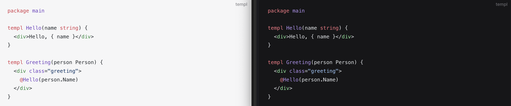

<div align="center">
    <h1>shiki-templ</h1>
    <h2>Enabling Templ syntax highlighting in Shiki.</h2>
    &nbsp;
    <a href="https://www.npmjs.com/package/shiki-templ" target="_blank"></a>
    <a href="https://github.com/indaco/shiki-templ/blob/main/LICENSE" target="_blank">
        
    </a>
</div>
<br/>

`shiki-templ` makes easier to use the TextMate grammar definition for [Templ](https://templ.guide) with [Shiki](https://shiki.matsu.io/).

The package fetches the [online](https://github.com/templ-go/templ-vscode/blob/main/syntaxes/templ.tmLanguage.json) version of the grammar file.

> [!NOTE]
> A [PR](https://github.com/shikijs/textmate-grammars-themes/pull/68) has been submitted to officially add Templ language support to Shiki. > This package will be used in the meantime.



## Installation

You can install the package using npm, pnpm, or yarn:

```bash
# npm
npm install shiki-templ

# pnpm
pnpm add shiki-templ

# yarn
yarn add shiki-templ
```

## Usage

### Shiki

To use the `shiki-templ` with Shiki, please refer to the official [Load Custom Language](https://shiki.matsu.io/guide/load-lang) page.

### Vitepress

Here's how you can configure [Vitepress](https://vitepress.dev/) to use the `shiki-templ`:

```typescript
import { defineConfig } from "vitepress";
import { templLang } from "shiki-templ";

// https://vitepress.dev/reference/site-config
export default defineConfig({
    // ...
    markdown: {
        languages: [templLang],
    },
}):
```

## License

This project is licensed under the MIT License - see the LICENSE file for details.
